# Project MySmartScale - Community version - Preview

This repo provides the community version of "Project MySmartScale". The community version manages up to five workers. This version is as-it-is without support. For a supported version with more then five managed workers contact my employer (sales@sepago.de).

## What is Project MySmartScale

This project gives answers to a very important challenge regarding Windows Virtual Desktop or Citrix Virtual Apps and Desktops in Azure: In a cloud environment, virtual machines are paid based on “switched on” time – even if the resources are not in use. Managing the execution of session hosts is crucial for resource-efficient IT.

Project MySmartScale starts and smartly deallocates session hosts. It learns about the user’s behavior and actively logoffs sessions at the right time to save compute power – and money. This solution is 100% based on Azure platform services. 

### Some features:

**Allocate session hosts before they are needed**

- Predict and prepare the right count of session hosts before users try to logon
- Scale the session host count based on the real workloads of the past (learned)
- Handle special weekdays (Sat./Sun) and public holidays

**Logoff disconnected users actively if possible – by pre-defined rules**

- Prevent logoff based on typical working hours
- Roaming times (e.g. drive home after work) -> prevent logoff
- In the afternoon -> logoff disconnected session faster

**De-allocate session hosts**

- De-allocate session hosts automatically

**And more**

- Configuration and monitoring via web service
- Schedule session host count (important for starting a new WVD environment)
- For a shared/pooled session host environment at the moment 
- Realistic savings: 60-70% (savings!) in a shared environment for a normal 10 business hours a day      company with no shifts regarding 24/7 runtime of the session hosts

**Build for shared hosts**

- Windows Virtual Desktop
- Citrix Virtual Apps and Desktops running in Azure as IaaS (without Citrix Cloud)

### How does it work?

Project MySmartScale gets information from the session host called workers. The data include information about connected and disconnected sessions, the load of the worker and some other information. This data are summarized by the ControlUnit which  starts and deallocate workers fitted to the current and expected usage of the environment. If the ControlUnit runs over a long time the CU can predict the session count for the next time and can pre-start the worker. With this prediction method, you have the right count of workers running if the users try to logon (to handle a "logon storm").

All scaling activities are on a per host pool / delivery group base.

Project MySmartScale based on Azure platform services:

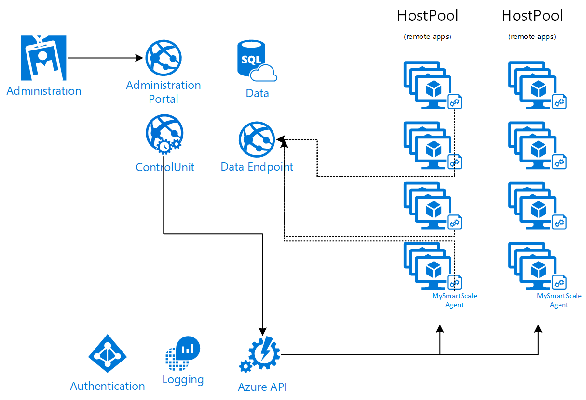

## Installation and configuration

### Azure services

Press the deploy to Azure button on the bottom to deploy the resources into your subscription. Make sure that you enter a worldwide unique name for your deployment. Some ressources need to be unique.

Create a secret SQL database password for your deployment. **Do not** leave this field as it is.

The following Azure resources are deployed:

- SQL database for the data
- Log Analytics workspace for the application log
- One web plan with two web sites:
  - -data as the data endpoint
  - -portal website for configuration
- some other resources supporting the deployment

 <a href="https://portal.azure.com/#create/Microsoft.Template/uri/https%3A%2F%2Fraw.githubusercontent.com%2FMarcelMeurer%2FProject-MySmartScale%2Fmaster%2Ftemplate.json" target="_blank">

#### Create the Azure AD service principals

##### Administration portal

Use the Azure portal and navigate to Azure Active Directory -> App registrations -> New registration

Enter a name for the service principal (in my case I used svc_WVD_PortalAuthentication) and click register.

Configure the service principal:

Set checkbox “ID tokens” and save:

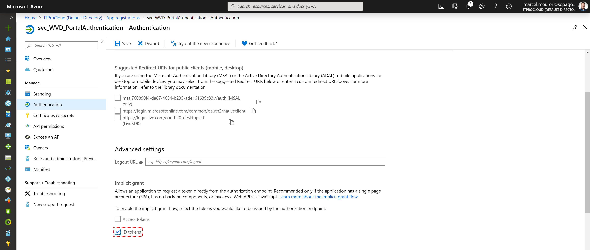

Certificate and secrets: Client Secrets -> New client secret

And copy the key for later (in my case: Rxxxxxxxxxxxxxxxxxxxxxxxxxxxxxxx)

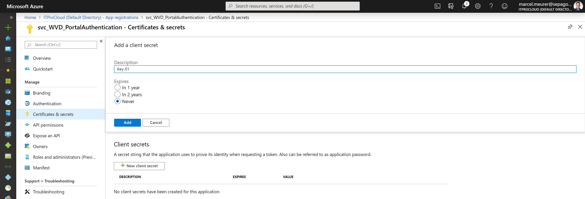

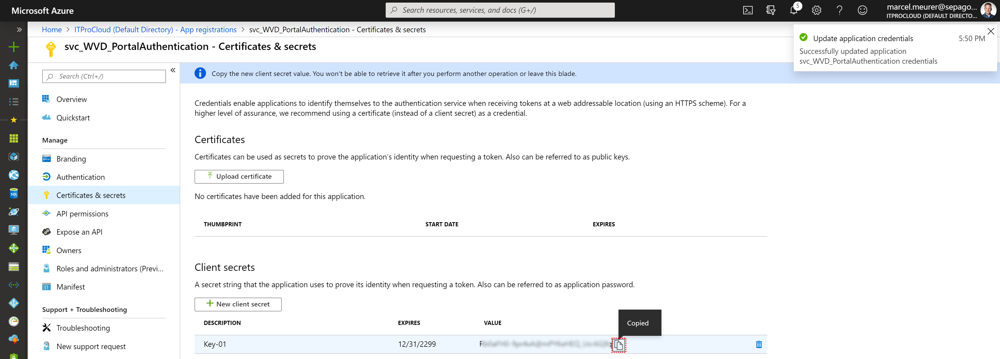

Add permission for the application to read the users profile and group membership.
Add a permission -> Type: Application -> Graph API -> User.Read.All

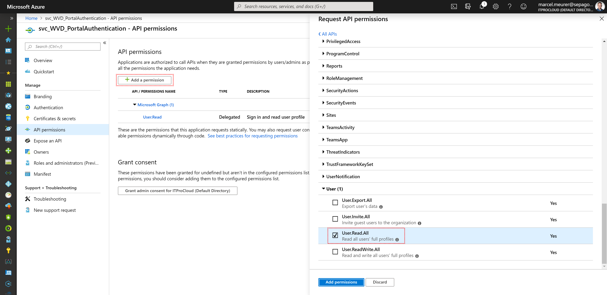

After this an admin has to consent to that permission:

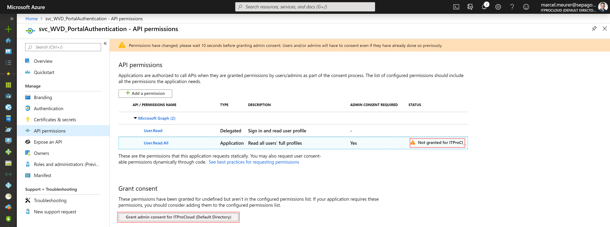

Edit the manifest of the service principal (to allow reading usergroups). Change the null value on "groupMembershipClaims" to "SecurityGroup":

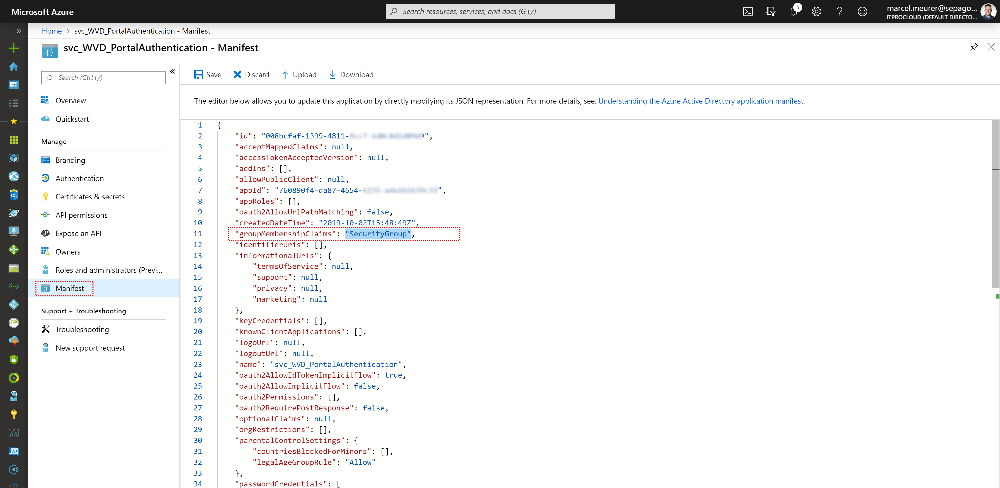

Copy from overview:
Application (client) ID:	760890f4-da87-4654-b235-xxxxxxxxxxxx
Directory (tenant) ID: 	1dd9bdbf-f4ac-4244-9415-xxxxxxxxxxxx

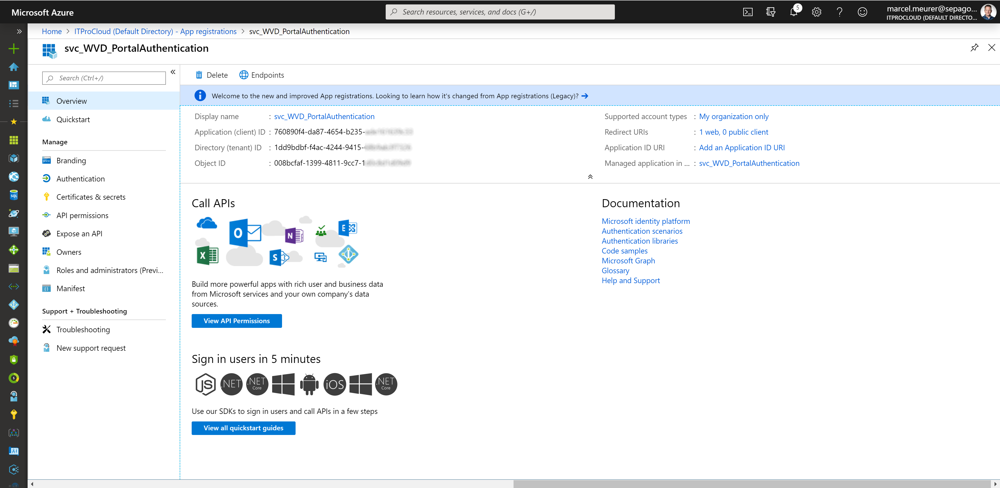

Finally go to the Service principal and change callback URI to your deployment Uri / name. In my case:
https://**wvd-mysmartscale-portal**.azurewebsites.net/.auth/login/aad/callback

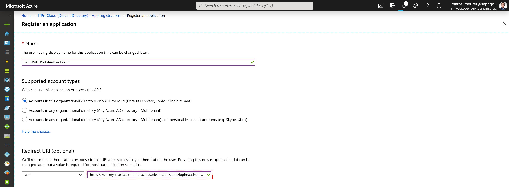

##### Automation account for the VMs

Use the Azure portal and navigate to Azure Active Directory -> App registrations -> New registration

Enter a name for the service principal (in my case I used svc_WVD_VmAuthentication) and click register.

Configure the service principal:

Go to Certificates & secrets -> New client secret -> type a name and select the time the key is valid:

Press “Add” and copy the key for later.
Bxxxxxxxxxxxxxxxxxxxxxxxxxxxxxxx

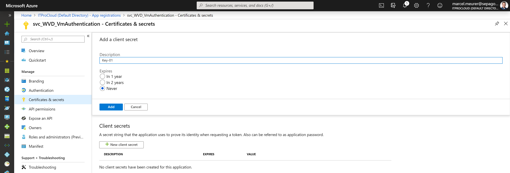

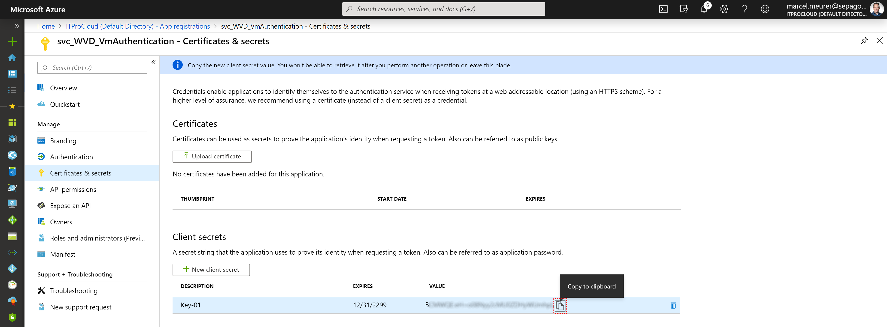

From the overview copy:

Application (client) ID	66b55744-4573-408d-81e1-xxxxxxxxxxxx
Directory (tenant) ID	1dd9bdbf-f4ac-4244-9415-xxxxxxxxxxxx

Go to the resource group (or groups) containing your VMs and add the service principal:
Access control -> Add -> Role assignment 
Role: Virtual Machine Contributor
Select: Name of the service principal
Click -> Save

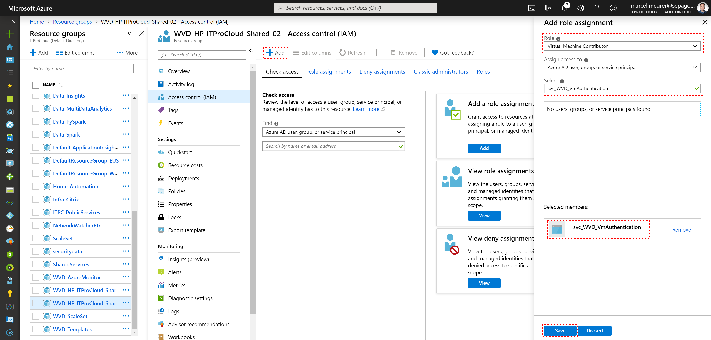

#### Configure the Azure resources with the service principals

##### Web Application

Enter the data from the portal service principal into the portal configuration. Go to the deployed resources and open the web app ending with "-portal". Open configuration and change the following values:

- ida:ClientId
- ida:ClientSecret
- ida:Domain	your Azure AD tenant id
- ida:TenantId	your Azure AD tenant id

Press save:

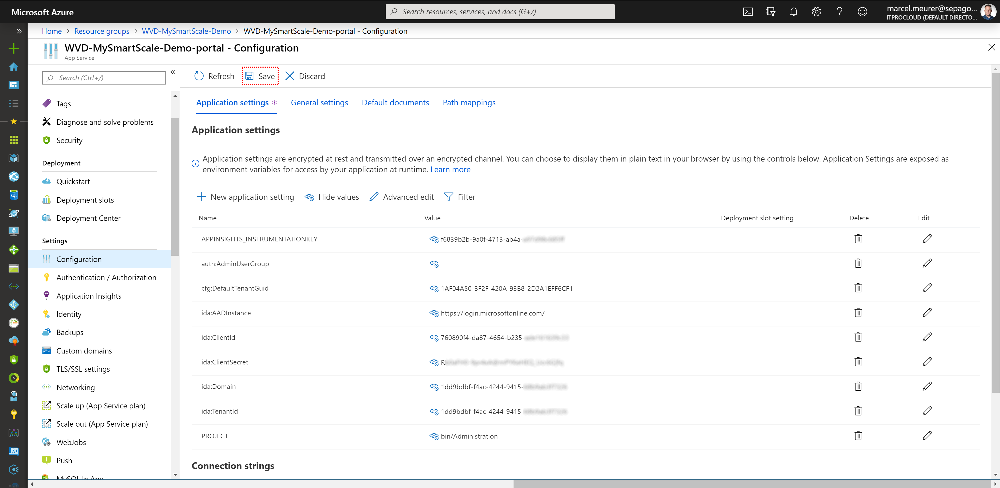

Important and recommend: Configure the security for the portal: Add a group id containing the administrators to allow login. If you don't do this: Everybody in your Azure AD **can logon and read the client secret** for the automation account.

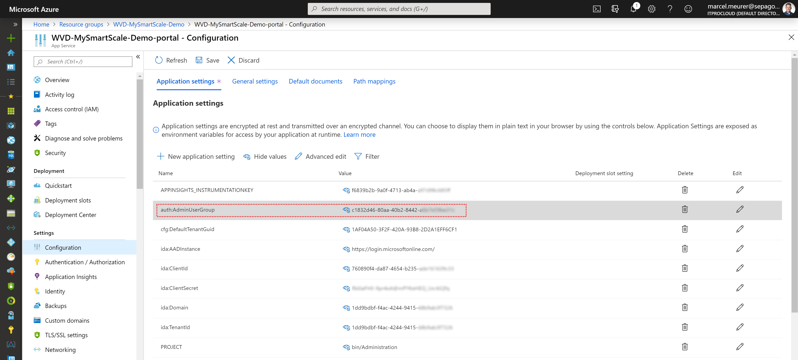

##### Basic configuration in the portal

Start the Project MySmartScale portal and configure the basics. Add the service principal, secret and Azure AD tenant id you previously created (to start and deallocate the VMs).

The portal Uri is (use your deployment name): https://**wvd-mysmartscale-portal**.azurewebsites.net

Login and go to configuration.

Enter the service principal data from your automaton sp:

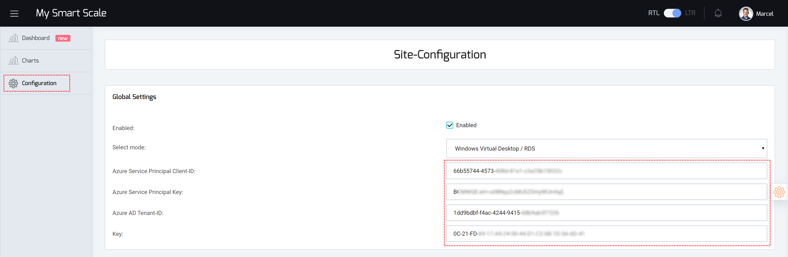

Additionally: Generate a secret passphrase (without quotes) and add it into the key field: Don't use the generated passphrase. This passphrase is later for the configuration of the agent.

### Worker Agent

Each WVD session host needs an agent. The agent is located in this repo: bin/WorkerAgent

Copy the files to your WVD session host master image in a folder. E.g: C:\Program Files\SmartScaleAgent and make sure that only admins can access this folder.

Configure the agent by editing ITPC-MySmartScale-Agent.exe.config

```xml
 <appSettings>
    <add key="EndPoint-URI" value="Enter the https endpoint address of your MySmartScale data instance starting with https://your-installation.azurewebsites.net/data"/>
    <add key="EndPoint-Key" value="Enter the generated key of your MySmartScale configuration (visit the portal site)"/>
     ....
```

Set the EndPoint-URI to the Uri of your **-data** web app appendet with /data: https://**wvd-mysmartscale-data**.azurewebsites.net/data

Set the EndPoint-Key to the value you have configured in the configuration (see above).

To install the agent, open an administrative command prompt and navigate to the agent (C:\Program Files\SmartScaleAgent ). Type the following line to install the agent:

```cmd
ITPC-MySmartScale-Agent.exe -install
```

This installs the agent as a scheduled task, which starts with the boot of the worker. The agent starts with the next boot of the worker.

Hint for Windows 7 64 bit: Add the following key/value to allow using TLS 1.2:

```
HKEY_LOCAL_MACHINE\SYSTEM\CurrentControlSet\Control\SecurityProviders\SCHANNEL\Protocols\TLS 1.2\Client

Reg-Dword:	DisabledByDefault	Value: 0
```


### Admin portal

Go to the admin portal and login with your account which is in the admin group you defined above (auth:AdminUserGroup).

The portal Uri is (use your deployment name): https://**wvd-mysmartscale-portal**.azurewebsites.net in my case.

Check, if you can see data from your worker on the Dashboard menu.

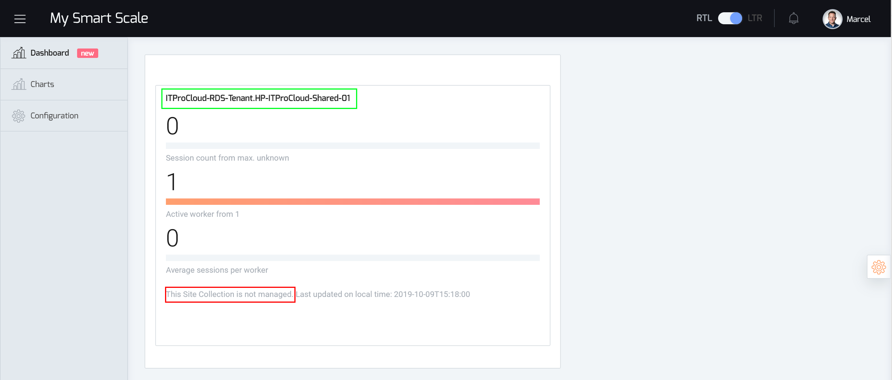

You should see the host pool name and the number of workers sending data. In the last line, you can read that this host pool (site collection) is not managed. This means that no scaling configuration for this host pool exists. Copy the full host pool name. In my case "ITProCloud-RDS-Tenant.HP-ITProCloud-Shared-01".

Hint: The host pool name contains the tenant name. If you use Project MySmartScale with Citrix IaaS in Azure it contains the Citrix site name. Host pool name and site collection are equivalent names.

#### Add a new site for autoscaling the VMs

Go to configuration and click on "Add new site".

Enter the full name of your host pool / site collection - or paste the previously copied string ("ITProCloud-RDS-Tenant.HP-ITProCloud-Shared-01"). This will create a scale configuration for your host pool.

All scaling configurations are applied per host pool. Click your host pool and continue configuring.

##### Configure ScaleParameter

Scale parameters are the main configuration for your host pool. The most importanted configurations are:

**Average sessions per worker**

The average amount of session a worker in your host pool can handle

**Average start-up time in minutes**

Time in minutes a worker takes to start from a deallocated mode into a running state (including domain connectivities). This time is used by the starting process.

**Minimum worker count**

The number of workers are running full time (a least two for reliability). A few workers need to run the full time. This is important to handle unexpected logon request and to start up more workers based on requests).

Additional configurations (if you start, use the default values):

| Option                                                       | Description                                                  | Range  | Default |
| ------------------------------------------------------------ | ------------------------------------------------------------ | ------ | ------- |
| Security serve in %                                          | Percent of spare in percent                                  | 0..1   | 0       |
| Add sessions for calculation                                 | Add a count of session on top of the existing ones for calculation of the needed workers. Can be used to give an +1 for VDI mode (have at least one free worker running) | 0..n   | 0       |
| Logon prediction based on n weeks                            | Prediction based of the last n weeks                         | 0..8   | 3       |
| Logon prediction based on n days                             | Prediction based of the last n days (if weeks couldn't applied) | 0..7   | 3       |
| Logon acceleration based on the last n minutes               | Calculate the logon acceleration from the last n minutes to now | 0..5   | 1       |
| Start scale-down process only if n scale-down commands in a row | Scale down starts after repeating a scale down command n-times in a row | 0..10  | 3       |
| Send scale-down command after n minutes of no new connections | Send scale-down command after n minutes of no new connections | 0..60  | 3       |
| Send scale-down command after n minutes if the connection count stays constant | Send scale-down command after n minutes if the connection count stays constant | 0..60  | 2       |
| Send scale-down command if the count of disconnected/connected sessions greater then | Send scale-down command if the count of disconnected/connected sessions greater then | 0..1   | 0.4     |
| Average compute costs per worker per hour                    | Average compute costs per worker per hour in this site collection | float  | 1.01    |
| Currency string                                              | Currency string                                              | string | $       |

Hint: If you set both "Logon prediction based on ..." to 0 no prediction based on historical data is made.

##### Configure active logoff conditions

Active logoff conditions allow the configuration of logging of the disconnected session after a defined time. In contrast to the configuration via group policies, the times can be precisely defined in steps of 5 minutes based on the day of the week. Specifying active logoff conditions **is important** to faster logoff users and deallocate the workers (**only** workers **without** sessions are deallocated). 

- Open active logoff conditions and add a new configuration by clicking "+"
- Set the time after a disconnected session will be logged of entering the value into "Logoff Disconnected session after n minutes"
- Select a specific weekday from the list and the valid time frame
- While you can have multiple active logoff conditions (which can have overlapping time frames) enter a priority. 0 has the highest priority

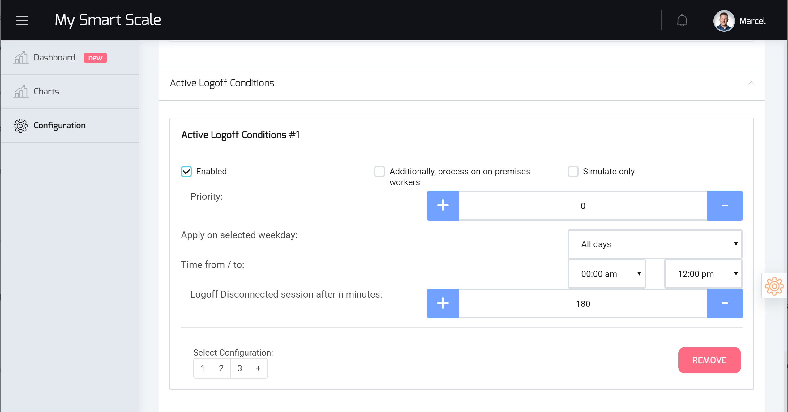

A best practice:

Allowing disconnected sessions for 3 hours at the main working hours while the rest of the week disconnected sessions are logged off after 60 minutes. Main ours are: Mo-Fr between 06:00 am and 08:00 pm. Configure the following conditions:

- 180 minutes for all days (00:00 am to 12:00 pm) with priority 1
- 60 minutes for Saturday (00:00 am to 12:00 pm) with priority 0
- 60 minutes for Sunday (00:00 am to 12:00 pm) with priority 0
- 60 minutes for all days (00:00 am to 06:00 am) with priority 0
- 60 minutes for all days (08:00 pm to 12:00 pm) with priority 0

##### Configure schedules

Schedules are used to define timeframes where a specific amount of workers should be running at least. For example: With schedules, you can define that a number of n workers have to be running from 6:00 am to 9:00 am to handle the logon storm in the morning. Please do this if you start using MySmartScale or virtual desktop. If you start from scratch the ControlUnit has no data to predict logon storms. Do the same when you go into production from a pilot and the number of connections will increase significantly (and not predictably for the system). 

Schedules only define a baseline.Upscaling will be done by the ControlUnit based on acceleration and count of sessions.

Schedules could be removed in the normal operation mode.

- Open schedules and add a new one by clicking "+"
- Set the number of workers should be running at least
- Select a specific weekday from the list and the valid time frame
- While you can have multiple schedules (which can have overlapping time frames) enter a priority. 0 has the highest priority

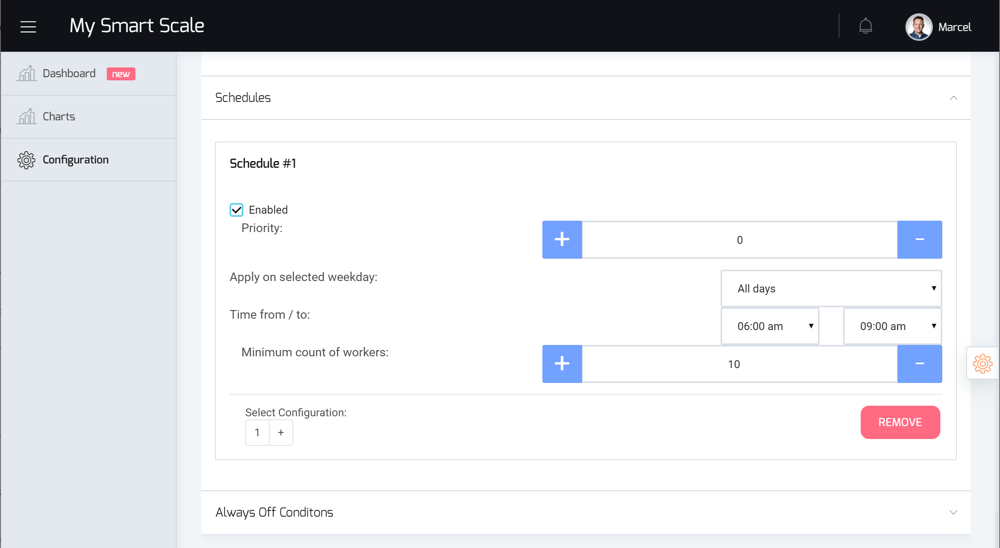

Example:

If you start with windows virtual desktop set the number off running workers between 6:00 am and 9:00 am to 10 on all days except on the weekend. Configure the following schedules:

- 10 workers all days (06:00 am to 09:00 am) with priority 1
- 2 workers all Saturday (00:00 am to 12:00 pm) with priority 0
- 2 workers all Sunday (00:00 am to 12:00 pm) with priority 0

##### Configure always off conditions

Always off conditions allow you to define a time frame where all workers are deallocated. This can save more money but has a big disadvantage: Nobody can log in to your environment at this time frame. So be aware and handle with care.

The configuration is comparable to adding schedules.


## Updates

This repo will be frequently updated to provide new features and maybe bug fixes. Updating your environment to the latest version is very easy:

### Agent update

Copy the files from the bin/WorkerAgent path and overwrite the existing files in your previous deployment on your master image - except the config file (If not otherwise specified).

### ControlUnit and administration portal

You can update the ControlUnit and administration portal by clicking  "Sync" at both web apps (-data and -portal). Go to each web app and click Deployment Center -> Sync

Important: Always update both web app one after the other.

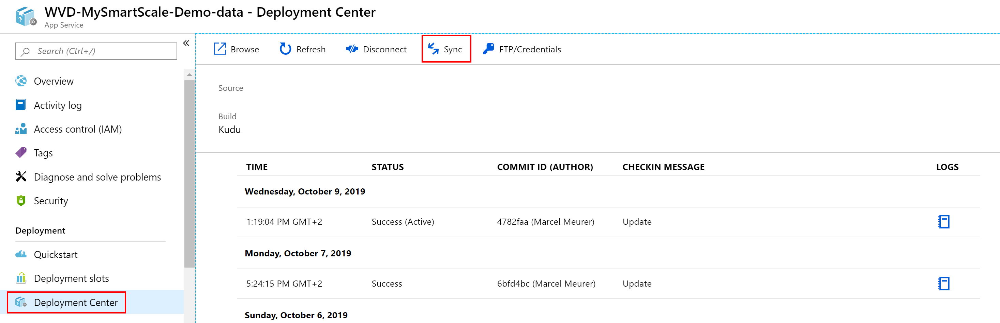

## FAQ

### Does the ControlUnit scale up new workers directly or is ther a delay?

The start of new workers takes place directly after the calculation of the number of new workers that will be needed. The current workload, logon acceleration and historical values serve as the basis. By consolidating the data of the individual workers every minute, the start is somewhat delayed. After the system has learned the workload over time, the workers are pre-started correctly. 

To ensure that scaling is successful starting with MySmartScale (without historical data)  it is advisable to set a schedule for the main logon time (e.g. from 6 to 10 a.m.) for the first weeks.

### What data are stored into the data table?

- Session data like active and inactive sessions for each worker
- Session data like active and inactive sessions for each site collection / host pool
- The configuration including the service principal and key for managing the worker / Azure VMs
- Statistics to logon/logoff time per user (you can pseudonymize the name by editing the configuration files of the worker agent)
- Management data for running the web app

### I notice that some data from the workers is not displayed/arrived synchronously. What can I do about it?

The workers should transfer their data regularly at the beginning of a new minute. Depending on time synchronization, transmission path, and database usage, this may delayed. By adjusting the waiting time before further processing, this effect can be prevented (causing the engine to react more slowly). The wait time can be increased from 0 to 1 at the web app running the ControlUnit (-data). Configuration item: *AzureControl-ConsolidateSessionDataLastCompleteTimeInMinutes*

### When are configuration changes applied?

Changes are applied at regular intervals. Max. every 5 minutes by default. This value can be changed at the web app running the ControlUnit (-data). Configuration item: *AzureControl-RefreshConfigurationEachMinutes*

### When does the system shutdown a worker?

The ControlUnit shut down workers if (based on the rules) are more workers online then needed. The number of needed workers is calculated by the expected number of sessions divides by the number of sessions a worker can handle on average.

Are there too many workers running the ControlUnit deallocates workers **without** **connections** - even disconnected sessions. Specify "Active logoff conditions" to speed up clearing workers from connections.


## Deploy to Azure

 <a href="https://portal.azure.com/#create/Microsoft.Template/uri/https%3A%2F%2Fraw.githubusercontent.com%2FMarcelMeurer%2FProject-MySmartScale%2Fmaster%2Ftemplate.json" target="_blank"></a>

